# Optimization runs on October 13, 2021

## Run 1
### Parameters  
    - initial parameters:  params0=[55000.0, 0.03,50.0, 3.0*10**-8]

### Initial fit:  
  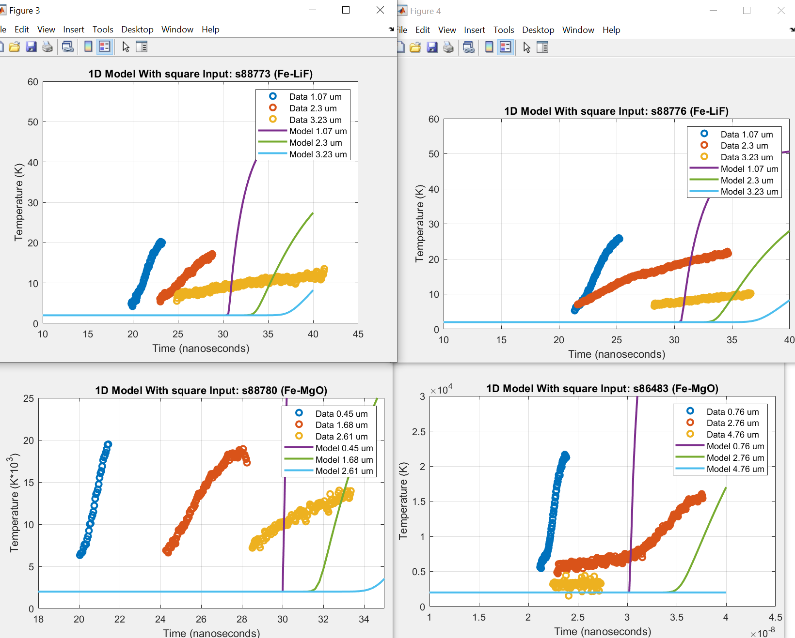  

### Final Fit:  
  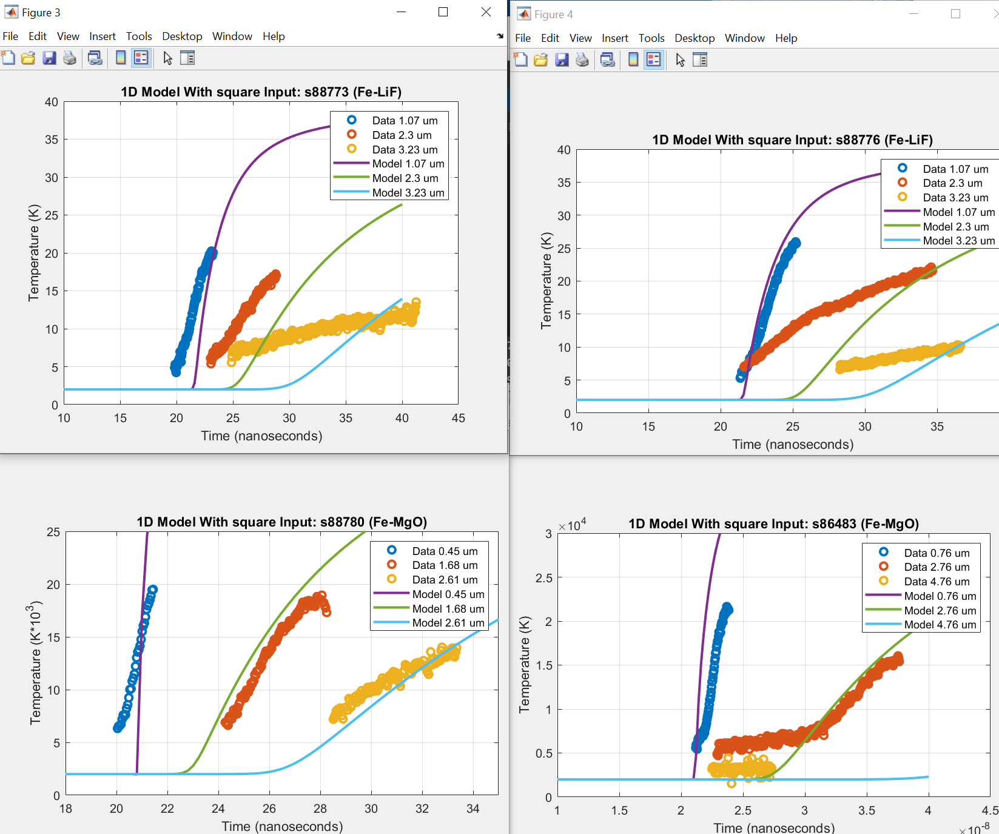  
  
### Parameters:
  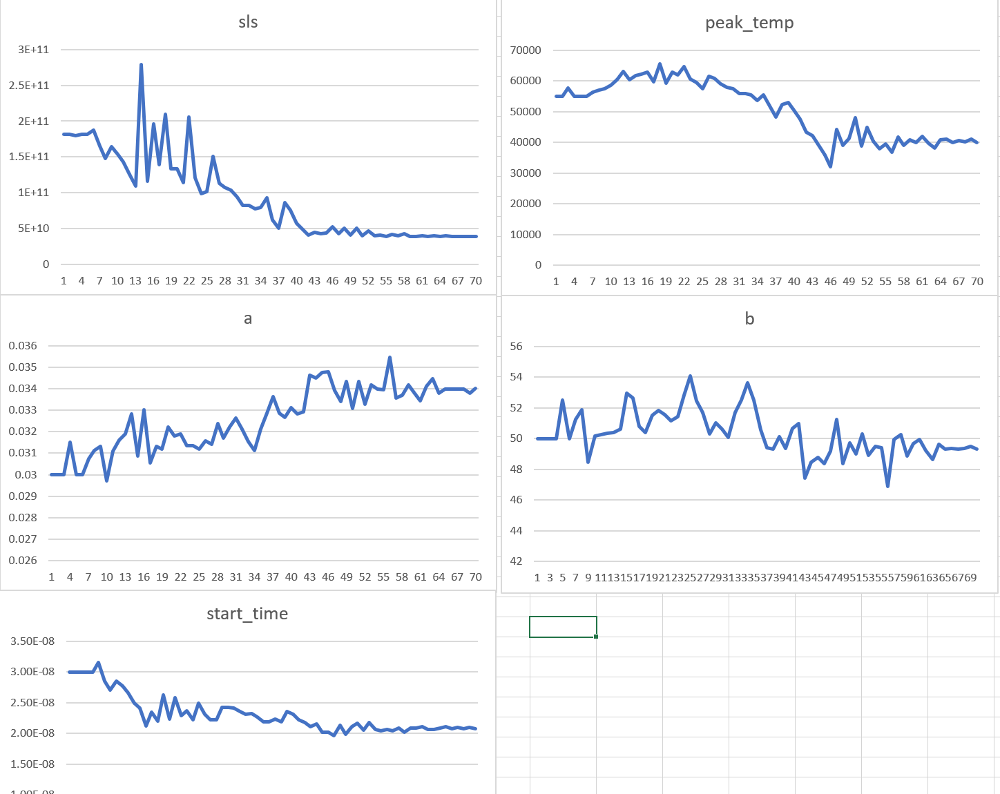

## Run 2
    - similar to run 1, but starting from different initial parameters

### Starting parameters:
    - params1=[45000, 0.03, 50.0, 2e-08]

### Initial fit:  
  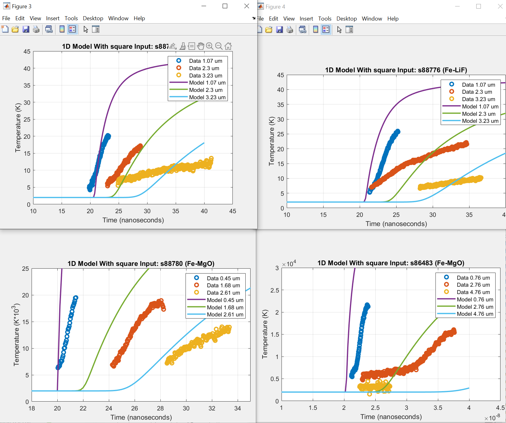  

### Final Fit:  
  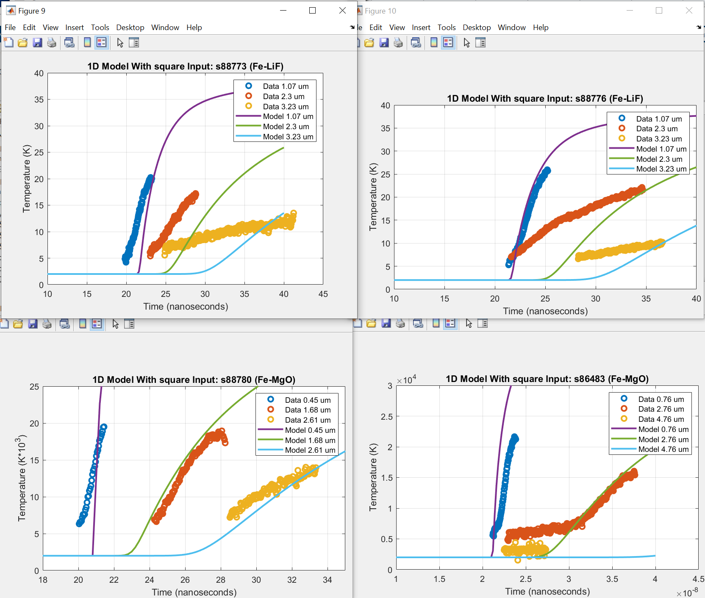  
  
### Parameters:
  

## Run 3

### Notes:
    - now trying to optimize for the first two faces on the first shot, shot s88773
    - using new function that holds peak_temp and start_time constant while optimizing for the two k parameters

### Parameters  
    - initial parameters:  params0=[0.03,30]

### Initial fit:  
  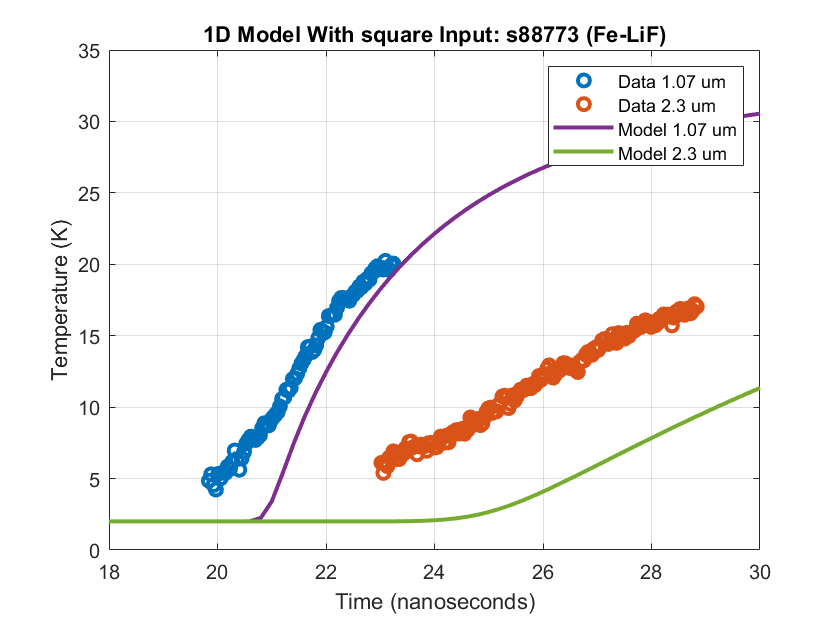  

### Final Fit:  
    
  
### Parameters:
  

## Run 4

### Notes:
  
### Parameters  
    - initial parameters:  params0=[30000,0.025,30.0,2.0*10**-8]
    - fitting with somewhat random initial parameters, and trying to get the optimization to converge

### Initial fit:  
  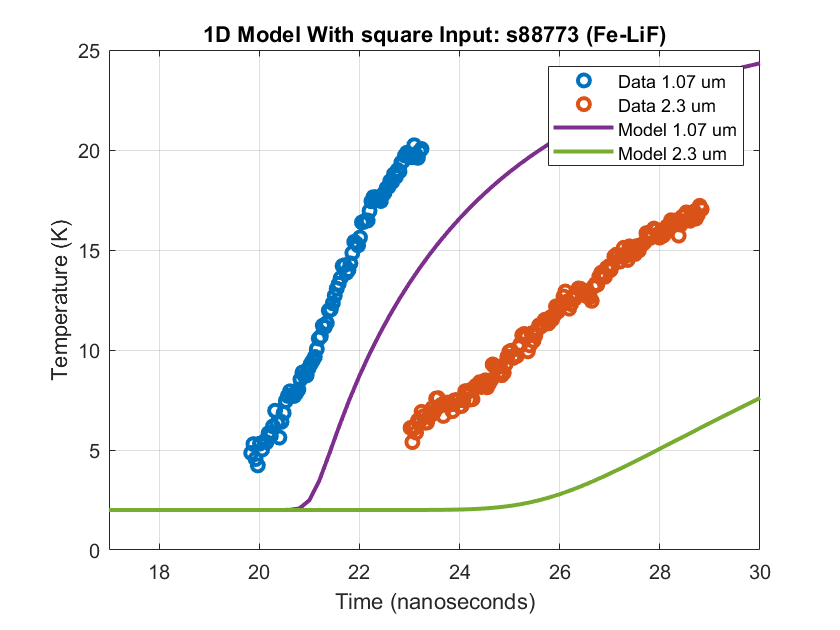  

### Final Fit:  
  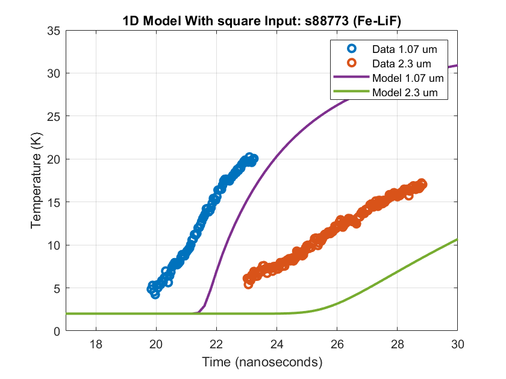  
  
### Parameters:
  

# Run 5
### Notes:
  
### Parameters  
    - initial parameters:  params0=[36000.0,0.017,30.0,2.0*10**-8]
    - fitting with optimal params from earlier (specified above)

### Initial fit:  
    

### Final Fit:  
  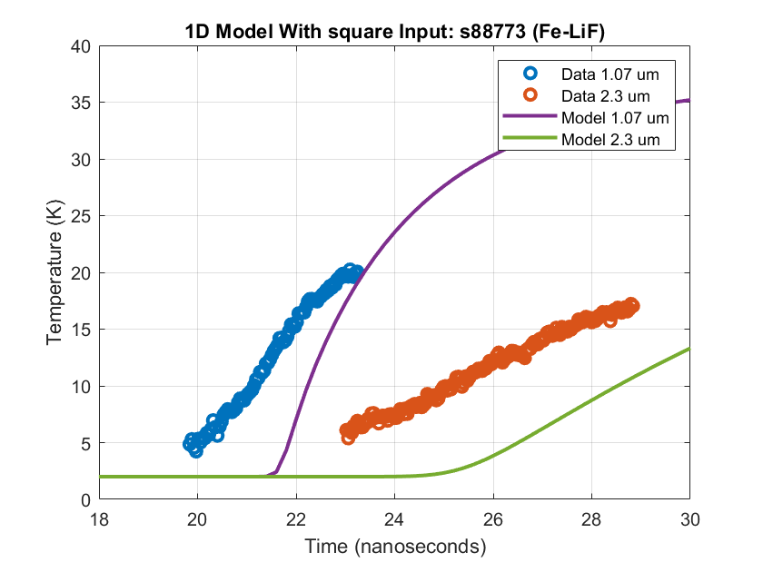  
  
### Parameters:
  

# Run 6
### Notes:
  
### Parameters  
    - initial parameters:  params0=[36000.0,0.017,30.0,2.0*10**-8]
    - same as the fit above, except we are only trying to fit the first face of the second run only
    - fit works well, started with a pretty good fit, so I really only marginally improved from there

### Initial fit:  
  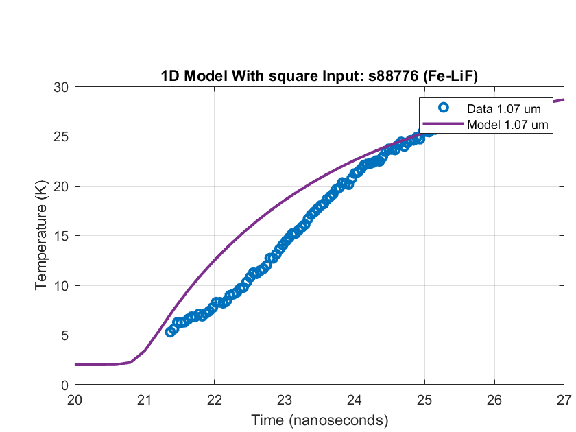  

### Final Fit:  
  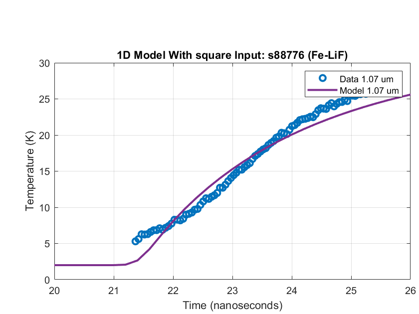  
  
### Parameters:
  

# Run 7
### Notes:
Fitting the s88780 data with the same initial parameters as runs 5 & 6

### Parameters  
    - initial parameters:  params0=[36000.0,0.017,30.0,2.0*10**-8]

### Initial fit:  
  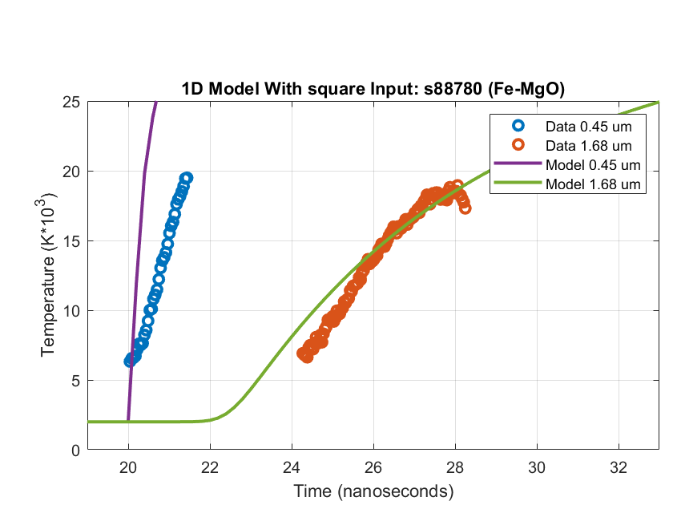  

### Final Fit:  
  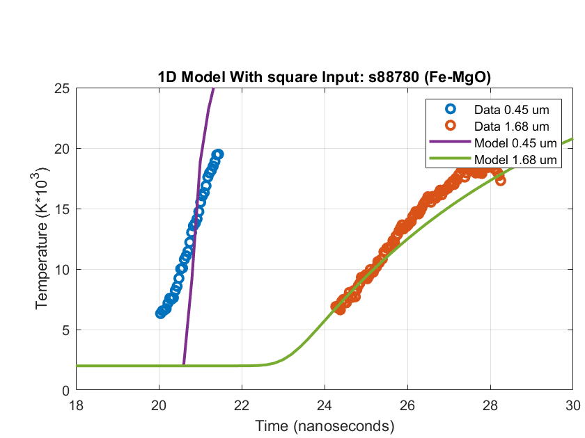  
  
### Parameters:
  

# Run 8
### Notes:
Fitting the s86483 data with the same initial parameters as runs 5, 6 & 7

### Parameters  
    - initial parameters:  params0=[36000.0,0.017,30.0,2.0*10**-8]

### Initial fit:  
  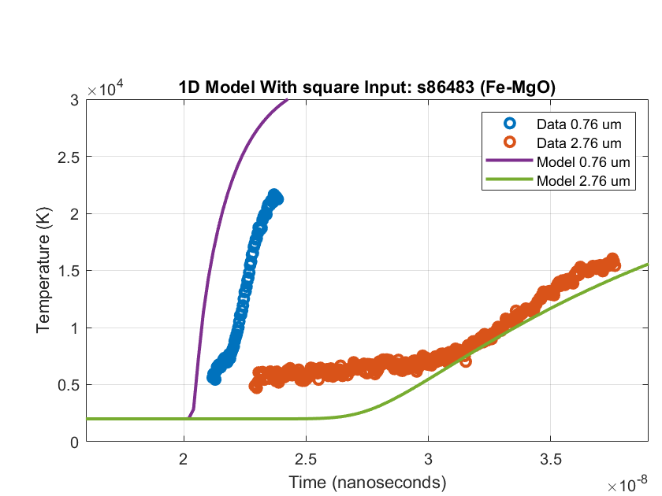  

### Final Fit:  
  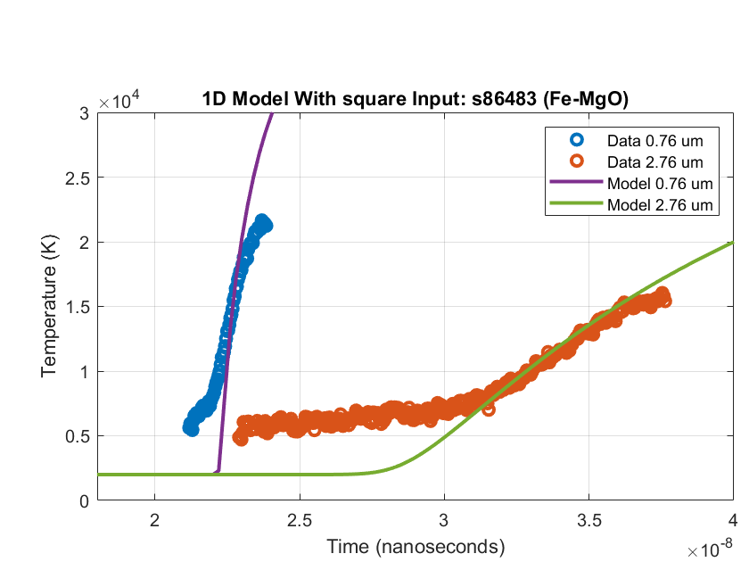  
  
### Parameters:
  