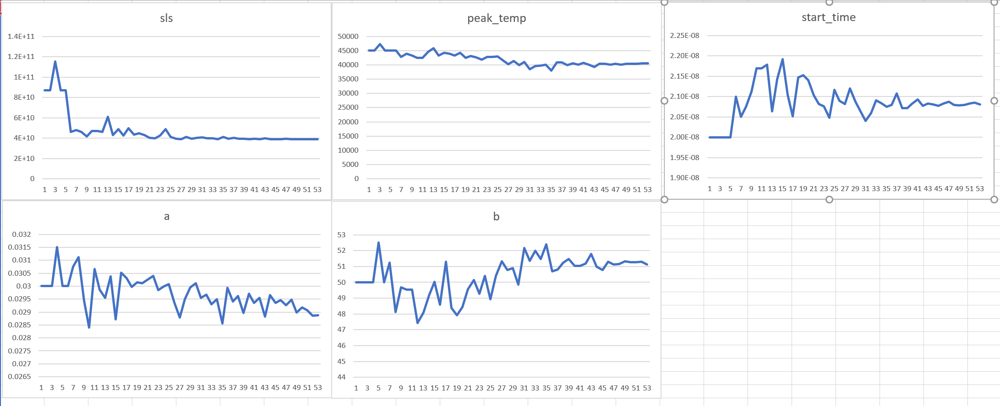
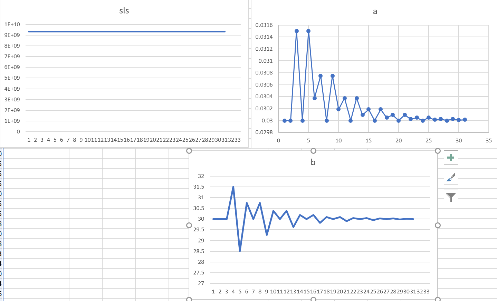

# Optimization runs on October 13, 2021

## Run 1
### Parameters  
    - initial parameters:  params0=[55000.0, 0.03,50.0, 3.0*10**-8]

### Initial fit:  
    

### Final Fit:  
    
  
### Parameters:
  

## Run 2
    - similar to run 1, but starting from different initial parameters

### Starting parameters:
    - params1=[45000, 0.03, 50.0, 2e-08]

### Initial fit:  
    

### Final Fit:  
    
  
### Parameters:
  

## Run 3

### Notes:
    - now trying to optimize for the first two faces on the first shot, shot s88773
    - using new function that holds peak_temp and start_time constant while optimizing for the two k parameters

### Parameters  
    - initial parameters:  params0=[0.03,30]

### Initial fit:  
    

### Final Fit:  
    
  
### Parameters:
  

